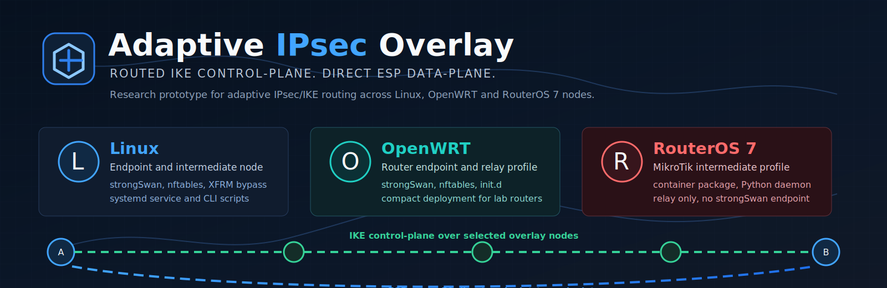

# Adaptive IPsec Overlay OpenWRT



OpenWRT endpoint and intermediate-node profile for the Adaptive IPsec Overlay
research prototype.

Related repositories:

- [Project hub](https://github.com/ZuyVladislav/adaptive-ipsec-overlay)
- [Linux package](https://github.com/ZuyVladislav/adaptive-ipsec-overlay-linux)
- [RouterOS 7 package](https://github.com/ZuyVladislav/adaptive-ipsec-overlay-routeros7)

This repository contains the OpenWRT deployment package:

- Python overlay daemon.
- nftables IKE capture rules.
- OpenWRT init.d service.
- strongSwan integration for router-hosted IPsec.

## Role

OpenWRT nodes can work as:

- IPsec initiator endpoint.
- IPsec responder endpoint.
- intermediate overlay node X1/X2.

After IKE negotiation finishes, ESP traffic remains direct between endpoints.

## Install

Copy the repository or release archive to OpenWRT, edit config, then run:

```bash
NODE_NAME=User11 CONFIG_SOURCE=examples/overlay.sample.json ./install.sh
```

Check:

```bash
/etc/init.d/adaptive-ipsec-overlay status
tail -f /var/log/hybrid-overlay-User11.log
```

## Repository layout

```text
core/       overlay protocol and IKE adapter
scripts/    OpenWRT-compatible firewall/start/stop helpers
examples/   sanitized overlay configs
install.sh  OpenWRT installer
```

## Status

Research prototype. Tested in an EVE-NG lab with OpenWRT as a full overlay
participant.

## Notes

This package is the OpenWRT-deliverable repository. It keeps the compact
installer and service layout needed for router deployment.
